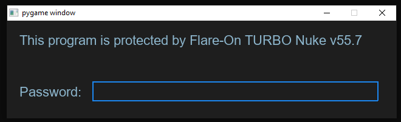
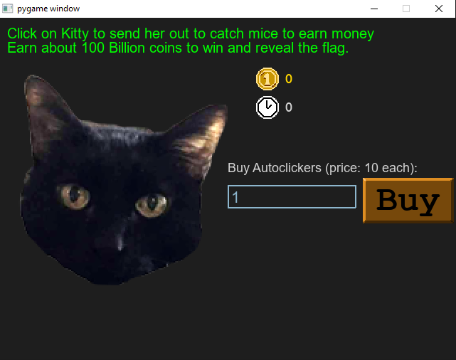

# 01 fidler

## Files
The challenge folder consists of folders for fonts and images, 2 python scripts, a text file and an executable.

```
|--01_fidler
    |--controls.py
    |--fidler.exe
    |--fidler.py
    |--Message.txt
    |--img/
    |--fonts/
```

---

## Initial Analysis

Looking through the files in the challenge folder, `Message.txt` looks to be just a normal introductory message to the flare-on ctf. It says that you can run the program via the executable or through the python file with PyGame

The fonts and img folders seem to only hold resources for the game

`controls.py` looks to be code for functionality of the game and does not provide much information

`fidler.py` contains the code for running the game and is the part that contains important information

`fidler.exe` should be the compiled version of `fidler.py` as mentioned in `Message.txt`

## Running the executable

Upon running the executable, a password screen is displayed:



Typing a random password will display a 'You done goofed' screen


Looking at the source file's main function, I can see that the game will only show if the `password_screen` function return true

Examining the `password_screen` function, the user input is compared to a key that is deobfuscated at runtime. The obfuscation method looks to be a simple substitution cipher by 1 position 

Running the function in python reveals the password `ghost`

Running the executable again with the password will show the game screen



It is possible to obtain the flag by simple playing the game, but it will take some time

Looking at the source code, the `game_screen` function will call the `victory_screen` function when the coin count reaches more than the target amount of `(2**36) + (2**35) = 103,079,215,104`

The code will try to deduct the coin count by `2**20 = 1,048,576` until it is within the range of the target amount +- 1,048,576

It will then get the integer value of the coin count divided by `10**8 = 100,000,000` which will return `1030`

This value will be passed to the `decode_flag` function which contains the encoded flag 

Copying the function to a seperate python file and running it with the argument `1030` will return the flag `idle_with_kitty@flare-on.com`


