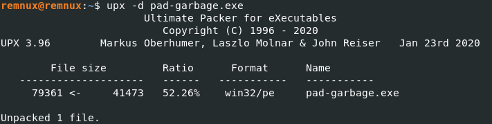
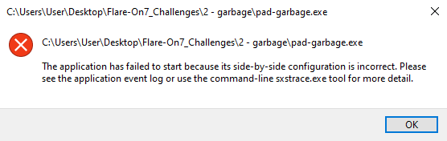
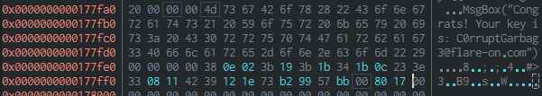

# 02 garbage

## Files
The challenge folder consists of a text file and an executable

```
|--02_garbage
    |--Message.txt
    |--garbage.exe

```

---

## Initial Analysis

The text file `Message.txt` says that `garbage.exe` is a recovered file and seems to be corrupted.

Opening the file in PEStudio shows an UPX signature. There are also UPX sections `UPX0` and `UPX1`, this gives a strong indication that the executable is packed.

PEiD also shows that the file is packed by UPX.


## garbage.exe

Since the file is packed by UPX, I tried to unpack it in remnux, however the unpacking failed.


Searching for this error online, I found suggestions to look at the source code of UPX. Searching the codebase of UPX, I found that this error happens when the overlay size is less than 0 or more than the actual file size.

This can be seen in CFF Explorer where the File Size is not equal to the PE Size


This could be due to the corrupted manifest seen in PE Studio


Since UPX only compares the overlay size with the file size, it migth be possible to fool UPX by adding some padding to the end of the file to make the numbers match.

By adding 732 null bytes to the end of the file, UPX was able to unpack the file.



Trying to run the unpacked file in Windows will result in an error due to the corrupted manifest



Analyzing the executable in cutter, the `main` function was able to be identified by cutter.

Looking at the `main` function, it looks to be setting up variables and 2 notable strings 
```
nPTnaGLkIqdcQwvieFQKGcTGOTbfMjDNmvibfBDdFBhoPaBbtfQuuGWYomtqTFqvBSKdUMmciqKSGZaosWCSoZlcIlyQpOwkcAgw

KglPFOsQDxBPXmclOpmsdLDEPMRWbMDzwhDGOyqAkVMRvnBeIkpZIhFznwVylfjrkqprBPAdPuaiVoVugQAlyOQQtxBNsTdPZgDH
```

`main` will then call `fcn_00401000` which performs XOR operations to deobfuscate a string.

When the function returns, the ecx regster contains a string `sink_the_tanker.vbs`. This might be a file that the executable is trying to create.

At `0x00401166`, `main` will try to call a function `0x40d00c` which might be an imported function as cutter is not able to find the function. NOP-ing the call allows the program to continue.

`main` will call `fcn_00401000` again which will then show the flag in the hexdump.



The flag is `C0rruptGarbag3@flare-on.com`

---

## Conclusion

I actually got stuck at trying to figure out how to restore the file so that it could be unpacked.

I didn't know what the errors in UPX were caused by, I had a hunch that the cut off manifest might be the problem but I didn't knew you can fool UPX by padding with null bytes.

Searching online I found another write-up on this challenge by explained.re where he showed where in the source code of UPX the error was located and that you can simply add null bytes to bypass the size check.


