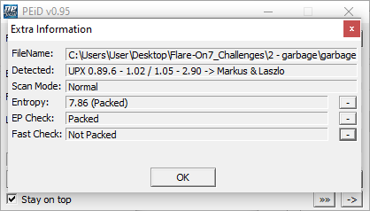
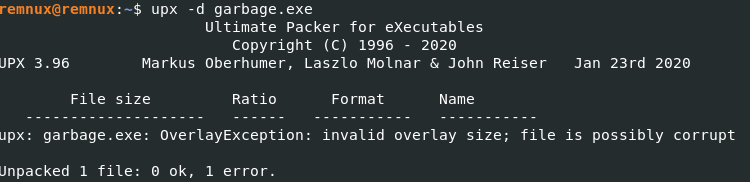
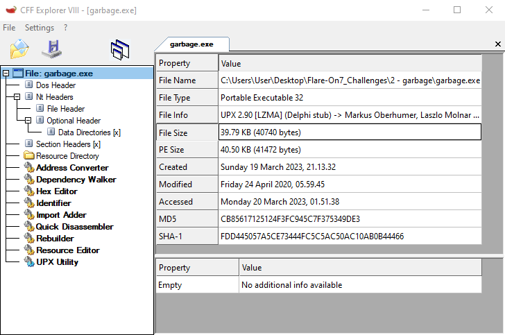
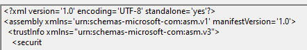

# 02 garbage

## Files
The challenge folder consists of a text file and an executable

```
|--02_garbage
    |--Message.txt
    |--garbage.exe

```

---

## Initial Analysis

The text file `Message.txt` says that `garbage.exe` is a recovered file and seems to be corrupted.

Opening the file in PEStudio shows an UPX signature. There are also UPX sections `UPX0` and `UPX1`, this gives a strong indication that the executable is packed.

PEiD also shows that the file is packed by UPX.




## garbage.exe

Since the file is packed by UPX, I tried to unpack it in remnux, however the unpacking failed.



Searching for this error online, I found suggestions to look at the source code of UPX. Searching the codebase of UPX, I found that this error happens when the overlay size is less than 0 or more than the actual file size.

This can be seen in CFF Explorer where the File Size is not equal to the PE Size



This could be due to the corrupted manifest seen in PE Studio



Since UPX only compares the overlay size with the file size, it might be possible to fool UPX by adding some padding to the end of the file to make the numbers match.

I tried to append a template manifest to the back of the file in an attempt to fix the cut-off manifest. But even after adding the manifest, UPX was still giving me an error.

## Stuck

I got stuck at trying to figure out how to restore the file so that it could be unpacked.

Searching online I found another write-up on this challenge by explained.re where he showed where in the source code of UPX the error was located and that you can simply add null bytes to bypass the size check. 

Perhaps my solution of padding a template manifest to the back of the file was still not enough to satisfy UPX's size check which led to another error.


