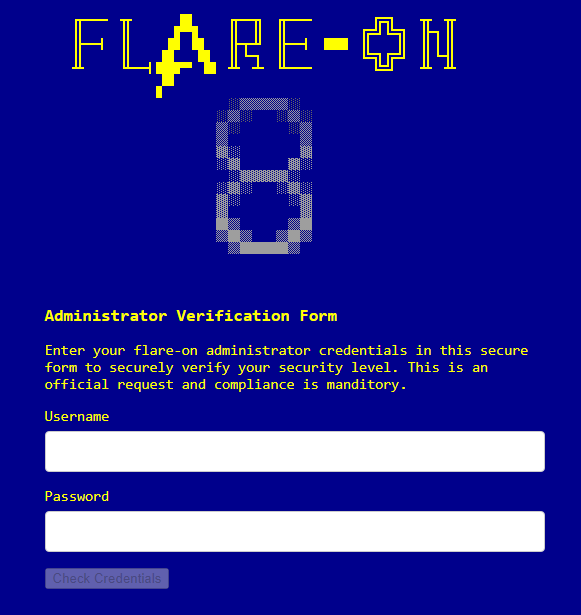
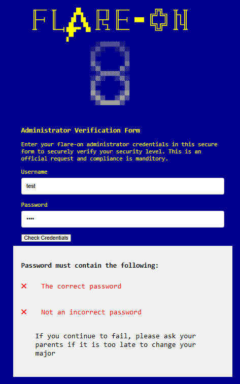
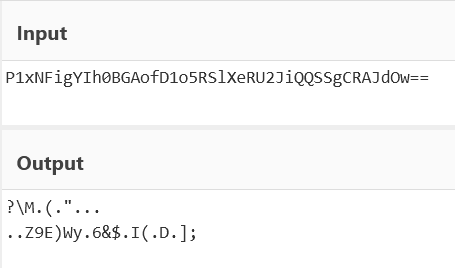

# 01 credchecker

## Files
The challenge folder consists of a html file and two images.

```
|--01_credchecker
    |--admin.html
    |--img
        |--goldenticket.png
        |--logo.png
```

---

## admin.html
Opening `admin.html` with a browser, a login screen is displayed.



Attempting to login with random values will return a login failed screen.



---

Using the browser to inspect the page, there is a `script` element which might contain hints.

There is a variable called `encoded_key` with the value of `P1xNFigYIh0BGAofD1o5RSlXeRU2JiQQSSgCRAJdOw==`

This looks like base64 encoding but running it through cyberchef decoder does not reveal much information.



Moving on, there are two functions `dataEntered()` and `checkCreds()`

`dataEntered()` looks to be just enabling the Check Credentials button as long as the username and password fields are not empty.

`checkCreds()` contains an `if` statement that checks if the username is equal to `Admin` and password is equal to `goldenticket`. 

However, the password value is put through a function `atob()` which takes in a base64 encoded string and returns a decoded ASCII string. 

Based on this information, the username would be `Admin` and the password would be `goldenticket` put through a base64 encoder, which would be `Z29sZGVudGlja2V0`.

Logging in with `Admin` and `Z29sZGVudGlja2V0` will reveal the flag.


# Conclusion
I found this challange easy as it was only HTML and there was no disassembly required. I knew to inspect the html in the browser to see how the script works.
