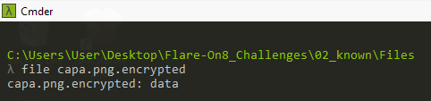
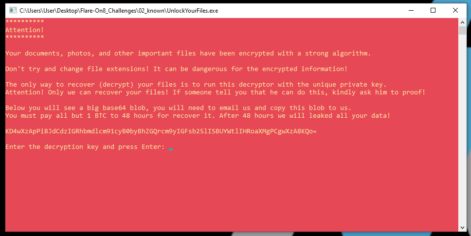
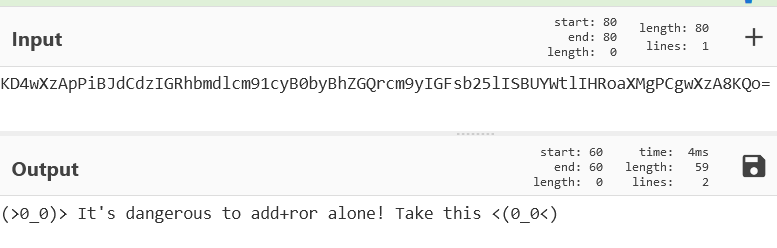
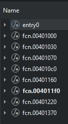
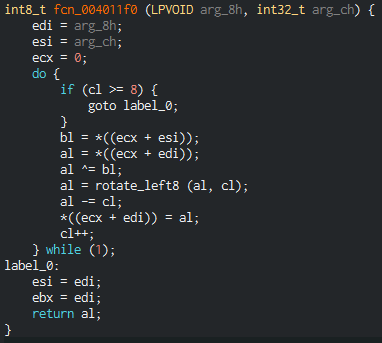
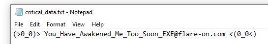

# 02 known

## Files
The challenge folder contains an executable and multiple files with an `.encrypted` extension
```
|-02_known
    |--UnlockYourFiles.exe
    |--Files
        |--capa.png.encrypted
        |--cicero.txt.encrypted
        |--commandovm.gif.encrypted
        |--critical_data.txt.encrypted
        |--flarevm.jpg.encrypted
        |--latin_alphabet.txt.encrypted
```

Running `file` on the encrypted files reval nothing much.



## UnlockYourFiles.exe

Running the executable opens a console window with the following message



The message contains a base64 string `KD4wXzApPiBJdCdzIGRhbmdlcm91cyB0byBhZGQrcm9yIGFsb25lISBUYWtlIHRoaXMgPCgwXzA8KQo=`

Decoding it reveals a message `(>0_0)> It's dangerous to add+ror alone! Take this <(0_0<)`



`add` and `ror` seems to refer to the assembly instructions add and rotate right respectively.

### Basic Static Analysis
Loading the executable into PE Studio, the executable loads only `kernel32.dll` and imports functions such as
```
ReadFile
FindFirstFileA
WriteFile
FindNextFileA
CreateFileA
WriteConsoleA
ReadConsoleA
```

This hints that the executable will have file read/write functionality and is able to find files in directories.

### Advanced Static Analysis

Using Cutter to analyse the executable, there are 9 functions including the entry function.



The `entry0()` function looks to perform the initial text printing and reading the user input of the decryption key. After that it will call function `fcn_00401370()`.

`fcn_00401370()` looks to perform searching of files with the `.encrypted` extension in the `Files` subdirectory. It will then call `fcn_00401220()` for each encrypted file.

`fcn_00401220()` will create the file to be write the decrypted contents to. It will read 8 bytes from the encrypted file and pass it to `fcn_004011f0()`. It will loop until the entire file is read and decrypted.

#### Decryption Algorithm

`fcn_004011f0()` contains the decryption algorithm, using Cutter's decompiler to help visualise what the function does:



The 8 bytes from the encrypted file is stored in the `edi` register and the key is stored in the `esi` register. `ecx` is used as the index and counter value. 

A byte from `esi` based on the index value will be loaded into the `bl` register. And from `edi` in to `al`.

`al` is then XOR-ed with `bl`, then `al` is rotated left by the `cl` value, finally `cl` is subtracted from `al`. 

This will repeat until `cl` reaches `8` where the function will return the `al` value.

Because the encryption algorithm is the inverse of the decryption algorithm, the encryption algorithm i add followed by rotate right followed by XOR. 

This seems to be the hint from the base64 string earlier, `add+ror`.

As this is an XOR encryption, it is possible to find the key by XOR-ing a known plaintext with a ciphertext. 

Since there is a file called `latin_alphabet.txt.encrypted`, it can be assumed that the contents in the original file might be the alphabets.

Using a python script `solve.py` to find the original key, it returns `bytearray(b'No1Trust')`

## Decrpyting with found key

Running `UnlockYourFiles.exe` with the key `No1Trust` will result in the files being decrypted sucessfully.

The image files are viewable and the text files can be read.

`critical_data.txt` contains the flag `You_Have_Awakened_Me_Too_Soon_EXE@flare-on.com`



# Conclusion
I found this challenge quite difficult as I was not well versed in bitwise operations and what they do. 

I got stuck after finding the first hint of `add+ror`. I knew it was hinting at assembly instructions but I did not know what to do with them. It was only after I disassembled the executable that I found out it was refering to the encryption/decryption algorithm.

In addition, I was not sure when I should move on from basic analysis to advanced analysis as I was afraid I did not find all the clues. 

But I learnt that I should just move on to other methods of analysis the moment I get stuck as it is faster to get more clues compared to trying to exhaust all basic analysis before moving on.

After reading the solution, I saw that I missed clues such as `42]kzN` being a hint for null bytes bring encrypted.