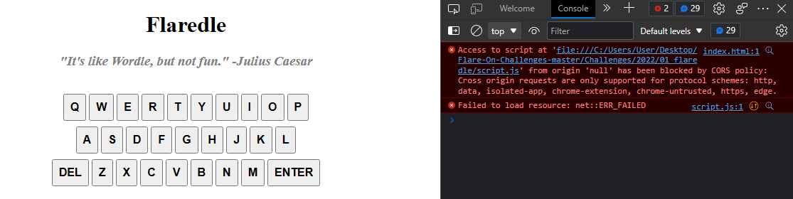
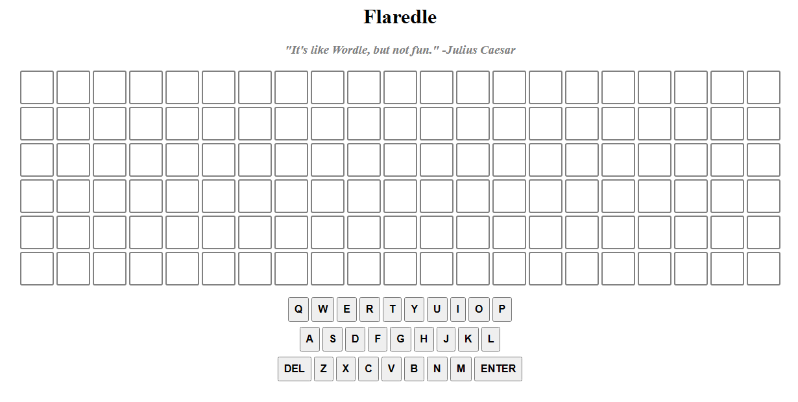
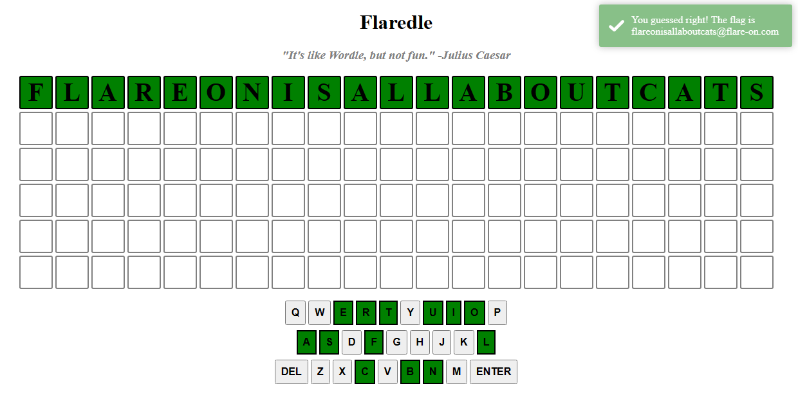

# 01 flaredle

## Files

```
|--01_flaredle
    |--index.html
    |--script.js
    |--style.css
    |--words.js
```

## Initial Analysis
Opening `words.js` with a text editor shows a large array of 170 words, all with 21 characters.

`style.css` does not seem to have anything worth noting.

`script.js` seems to be the file on interest and it imports the words found in `words.js`.

### index.html

Opening `index.html` directly will show a page with just a keyboard which does not do anything. This is due to the javascript file being blocked by the browser preventing Cross Origin Resource Sharing(CORS) for security reasons.



Instead, I opened a local server with python in the folder and accessed it via localhost.

Host python server with
```
python -m http.server
```
Access page with
```
localhost:8000
```

Now the proper page appears


This looks similar to wordle. But lets go back and examine `script.js` first.

### script.js
There are a few values that catch the eye, such as `CORRECT_GUESS` and `rightGuessString`

`rightGuessString` gets it value from the words in `words.js`, using `CORRECT_GUESS` as the index for the array of words.

This means `rightGuessString` would have the value `flareonisallaboutcats`.

Trying this string in the flaredle game will complete the game and give the flag



The flag is `flareonisallaboutcats@flare-on.com`