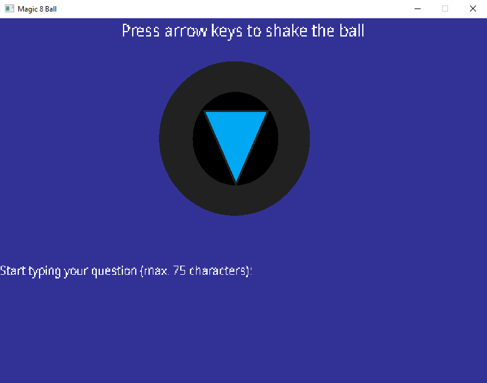
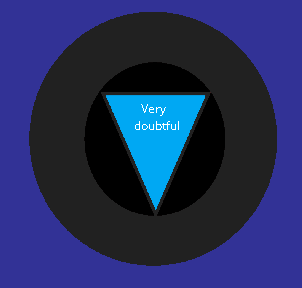
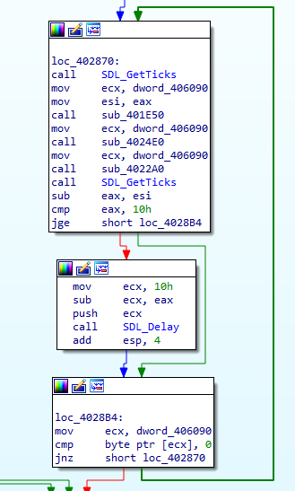
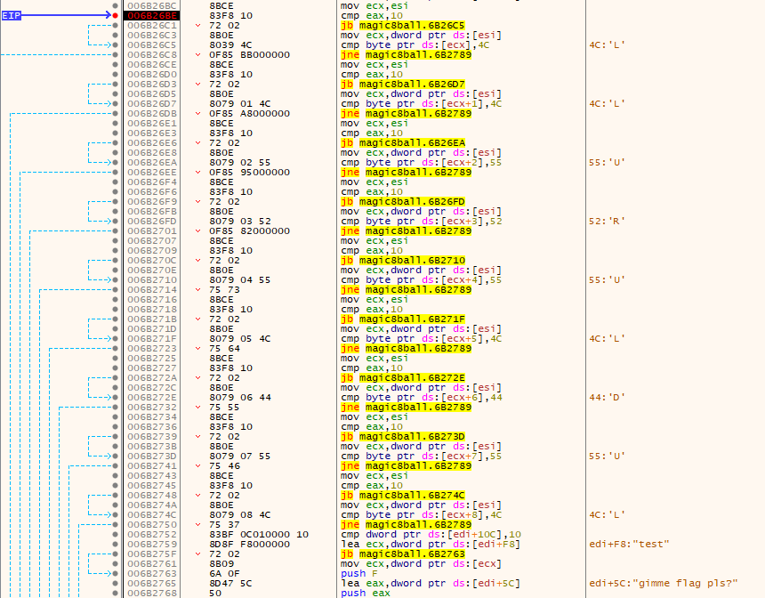
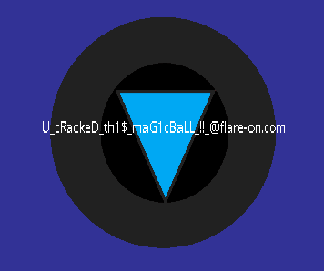

# magic8ball

## Files
```
|--03_magic8ball
    |--Magic8Ball.exe
    |--libjpeg-9.dll
    |--libpng16-16.dll
    |--libtiff-5.dll
    |--libwebp-7.dll
    |--SDL2.dll
    |--SDL2_image.dll
    |--SDL2_ttf.dll
    |--zlib1.dll
    |--assets
        |--ball_paint.png
        |--DroidSans.ttf
        |--NotoSans_Regular.ttf
        |--OpenSans_regular.ttf
```

## Initial Analysis

Looking to the assets folder only shows an image `ball_paint.png` which looks like a magic 8 ball.

The others are font files probably used by the executable.

Running `Strings` on `Magic8Ball.exe` shows some error messages and messages that look like magic 8 ball replies when you shake it.

Opening `Magic8Ball.exe` with CFF explorer shows that it imports `SDL2.dll`.

Searching SDL2 online points to the Simple DirectMedia Layer 2.0. There is also documentation for the API which might be useful later on.

---

## Running the program

Running `Magic8Ball.exe` displays a blue screen with the image found in the assets folder. There are also instructions to use arrow keys to shake the ball and to start typing your question.



Typing a message and using the arrow keys only shows a message on the magic ball image.



---

## Disassembly

Opening `Magic8Ball.exe` in IDA Free, I see that there are alot of functions, including those of SDL2.

Looking at the `start` function, it seems to be set up processes until the call for `sub_403680`.

`sub_403680` will simply call `sub_403690` which contains function such as `HeapAlloc`, it will then call `sub_4027A0`.

`sub_4027A0` looks to be the main function which creates the window that the user will see.

`loc_402870` contains the loop which will keep getting input from the user. 



Inside this loop, there is a call to a function `sub_401E50` which calls `SDL_PollEvent`, referring to the docmentation, `SDL_PollEvent` returns the events that happened, which includes key inputs from the user.

`sub_4024E0` is called afterwards which contains multiple checks to hex values and a `strncmp`

This function might be the check to obtain the flag.

---

## Debugging

The value to be used in the `strncmp` cannot be seen in IDA, so I will try to load it to x32dbg and see how `sub_4024E0` works.

Navigating to the function shows multiple checks against hex values which represent L, U, R and D in ascii.

Setting a breakpoint before the first comparison and running the program with `test` as the input, I can see that the `strncmp` is actually comparing my input against a string `gimme flag pls?`.



However, trying `gimme flag pls?` still does not work. Stepping through the assembly shows that the program skips the `strncmp` due to the first comparison against 0x4C which is 'L'.

After some thinking, I figured out that the letters L, U, R and D might mean the directions to shake the ball.

Trying the same string with the combination of `L L U R U L D U L` as the directional inputs gives the flag.



