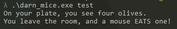

# 04 darn mice

## Files

```
|--04_darn_mice
    |--darn_mice.exe
```

The challenge folder consists of only a single executable file, `darn_mice.exe`.

## Initial Analysis

### Strings
Running the executable through `Strings`, there are some strings of note.

```
On your plate, you see four olives.
No, nevermind.
You leave the room, and a mouse EATS one!
Nibble...
When you return, you only: %s
salty
out != NULL check failed, %u
outlen < inlen check failed, %u
BCryptOpenAlgorithmProvider failed, %08x
BCryptDeriveKeyPBKDF2 failed, %08x
```
The first 7 strings look like strings that will be printed when the program runs.

The next 4 strings look to be error messages and include the use of BCrypt.

### CFF Explorer
Running the executable through CFF explorer, it further proves that bcrypt is used due to the `bcrypt.dll` import along with `kernel32.dll`.

## Running the executable

When running the executable, nothing happens. The command prompt opens and then closes.

Running it using the command prompt with the command `.\darn_mice.exe`, the program simply exits.

However, running it with an argument causes it to print some text before exiting.



There is not much more information from running the executable, so I'll move on to disassembly and debugging.

## Disassembly

Looking through the functions, `sub_401000` catches my eye as it contains some of the strings found earlier.

## Stuck

At this point I got stuck as I couldn't figure out how the code works. Even after trying to debug it via x32dbg. 

At least one thing I learnt was how to add arguments to the command line when using the x32dbg GUI.

I ended up referring to the solution to see how it works.

I failed to realize that I was supposed to make the loop return using the opcode for RETN. I was confused by the call to the buffer as I had never seen that before.

